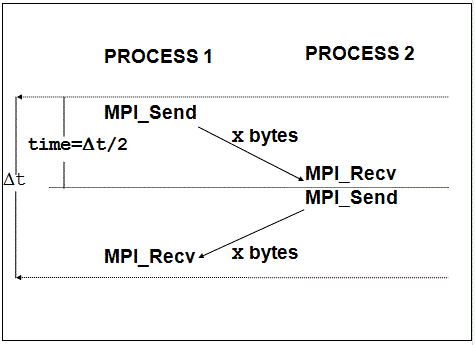

```{r setup, include=FALSE}
library(ggplot2)
knitr::opts_chunk$set(echo = TRUE)
```

# Section 1: MPI programming
## Section 1.1: 1D topology
The ring is implemented using non-blocking communication routine and 1D virtual topology with periodic boundary. 
The non-blocking implementation lead a linear growth of the execution time. The execution time of single iteration can be modelled  roughly as a *double PingPing*. 
The real performance will be of course worse than the ideal case, since that the PingPing take into account only 2 processes and does not consider crowded configuration with more than 2 processes. In any case we have a lower bound ideal model to find the expected performance.

The performance are measured over 10000 iterations, with UCX and InfiniBand, across core, socket and node. Across two node the mlx5_0 interface is used, with openMPI 4.0.3 module loaded. Times for theoretical model come from Intel MPI benchmark PingPing.

{#id .class width=400 height=310px}

\newpage

### Map by node model
The network model across two nodes can take into account the latency of the network (dominated by the switch) and the number of processes involved. Each iteration will be lower bounded by the network.
$$Time=N_{procs} \cdot \lambda_{network}\cdot 2$$

The estimated latency between two node with the Intel MPI benchmark is a bit less than the one declared by switch constructor. This lower latency hold only when few communications are going on. With multiple processes involved a more realistic declared latency of $1.35$ microseconds lead to a more accurate model, thus the model will be experimentally outperformed when $N_{procs}=2$. When the number of process grow, we can see a slightly slow down of the actual implementation. 

Across two node we can estimate optimistically $\lambda_{network}=1.01 \space \mu Sec$.
```{bash eval=FALSE}
#---------------------------------------------------
# Benchmarking PingPing 
# #processes = 2 
#---------------------------------------------------
       #bytes #repetitions      t[usec]   Mbytes/sec
            0         1000         1.00         0.00
            1         1000         1.00         1.00
            2         1000         1.01         1.98
            4         1000         1.01         3.94

```

### Map by socket model

With the socket round robin binding selected, we can model the ring behaviour as following, with the usual Intel MPI benchmark estimation.
$$Time=N_{procs}\cdot \lambda_{socket}\cdot 2$$
Again when the sockets become crowded the real performance is worse than the model.

Across two socket we can estimate $t=0.49 \space \mu Sec$
```{bash eval=FALSE}
#---------------------------------------------------
# Benchmarking PingPing 
# #processes = 2 
#---------------------------------------------------
       #bytes #repetitions      t[usec]   Mbytes/sec
            0         1000         0.49         0.00
            1         1000         0.48         2.06
            2         1000         0.49         4.12
            4         1000         0.49         8.18
```

### Map by core model

Mapping by core the processes we have to take into account how many processes are spawned and where. When $N_{procs}$ is less or equal than the number of core in a single socket, the expected execution time is bounded by the core communication. When the first socket is filled, the first process on the second socket will be the slowest over all process, his neighbors will be placed in the other socket and he will be the slowest in communication. Thus one iteration is long as the slowest process communication time. Experimentally a spike when $N_{procs}=13$ is clearly visible. Counter intuitively the performance increase respect $N_{procs}=13$ when the number of processes increase and other process are spawned in the second socket. 

The slowest processes now have one neighbor on the same socket and one on the other, so the complessive iteration time for the slowest process is $\lambda_{core}+\lambda_{socket}$. 


$$
  Time= \left\{
\begin{array}{ll}
      N_{procs}\cdot\lambda_{core}\cdot 2 & N_{procs}\leq N_{cpu\space core} \\
      N_{procs}\cdot(\lambda_{core}+\lambda_{socket}) & N_{procs} > N_{cpu\space core}+2 \\
            N_{procs}\cdot\lambda_{socket}\cdot 2 & N_{procs} = N_{cpu\space core}+1 \\
\end{array} 
\right.  
$$


Across two core we can estimate $t=0.23 \space \mu Sec$
```{bash eval=FALSE}
#---------------------------------------------------
# Benchmarking PingPing 
# #processes = 2 
#---------------------------------------------------
       #bytes #repetitions      t[usec]   Mbytes/sec
            0         1000         0.23         0.00
            1         1000         0.23         4.27
            2         1000         0.24         8.44
            4         1000         0.23        17.18
```

### Experimental results compared with theoretical model

```{r ring, include=FALSE, echo=FALSE}

ring_core=read.csv("./ring/timing/core.csv", header = TRUE)
ring_socket=read.csv("./ring/timing/socket.csv", header = TRUE)
ring_node=read.csv("./ring/timing/node.csv", header = TRUE)

ring_model_core=ring_core
ring_model_socket=ring_socket
ring_model_node=ring_node

core_latency=0.23
socket_latency=0.48
node_latency=1.35

ring_model_core$MEAN[ring_model_core$X.SIZE<=12]=ring_model_core$X.SIZE[ring_model_core$X.SIZE<=12]*core_latency*2
ring_model_core$MEAN[ring_model_core$X.SIZE>12]=ring_model_core$X.SIZE[ring_model_core$X.SIZE>12]*socket_latency+ring_model_core$X.SIZE[ring_model_core$X.SIZE>12]*core_latency
ring_model_core$MEAN[ring_model_core$X.SIZE==13]=ring_model_core$X.SIZE[ring_model_core$X.SIZE==13]*socket_latency*2

ring_model_socket$MEAN=ring_model_socket$X.SIZE*socket_latency*2


ring_model_node$MEAN=ring_model_node$X.SIZE*node_latency

sp1 = ggplot(ring_core,aes(x=X.SIZE,y=MEAN,color="Map by core",linetype="Real time"))  +
  scale_y_continuous(name="Time uSec",breaks = seq(0,45,by=5))+
  scale_x_continuous(name="Processor number",breaks = ring_core$X.SIZE) +
  geom_point() + 
  geom_line()  + 
  theme(axis.text.x = element_text(angle = 45, vjust = 0.5, hjust=0.5))+
  geom_point(data=ring_model_core,aes(x=X.SIZE,y=MEAN,color="Map by core"))+
  geom_line(data=ring_model_core,aes(x=X.SIZE,y=MEAN,color="Map by core",linetype="Theoretical time")) +    
  geom_point(data=ring_socket,aes(x=X.SIZE,y=MEAN,color="Map by socket")) +
  geom_line(data=ring_socket,aes(x=X.SIZE,y=MEAN,color="Map by socket",linetype="Real time"))+
  geom_point(data=ring_model_socket,aes(x=X.SIZE,y=MEAN,color="Map by socket")) +
  geom_line(data=ring_model_socket,aes(x=X.SIZE,y=MEAN,color="Map by socket",linetype="Theoretical time"))+
  geom_point(data=ring_model_node,aes(x=X.SIZE,y=MEAN,color="Map by node")) +
  geom_line(data=ring_model_node,aes(x=X.SIZE,y=MEAN,color="Map by node",linetype="Theoretical time"))+
  geom_point(data=ring_node,aes(x=X.SIZE,y=MEAN,color="Map by node")) +
  geom_line(data=ring_node,aes(x=X.SIZE,y=MEAN,color="Map by node",linetype="Real time"))+
  scale_color_manual(name="Mapping", values = c(10,12,13))+
  scale_linetype_manual(name="",values=c(1,2))+
  theme(legend.position = c(0.2, 0.8))

core_latency=0.23
socket_latency=0.48
node_latency=1.35

ring_model_core$MEAN_MESSAGE[ring_model_core$X.SIZE<=12]=core_latency*2
ring_model_core$MEAN_MESSAGE[ring_model_core$X.SIZE>12]=socket_latency+core_latency
ring_model_core$MEAN_MESSAGE[ring_model_core$X.SIZE==13]=socket_latency*2

ring_model_socket$MEAN_MESSAGE=socket_latency*2


ring_model_node$MEAN_MESSAGE=node_latency

sp = ggplot(ring_core,aes(x=X.SIZE,y=MEAN_MESSAGE,color="Map by core",linetype="Real time"))  +
  scale_y_continuous(name="Mean iteration time uSec")+
  scale_x_continuous(name="Processor number",breaks = ring_core$X.SIZE) +
  geom_point() + 
  geom_line()  + 
  theme(axis.text.x = element_text(angle = 45, vjust = 0.5, hjust=0.5))+
  geom_point(data=ring_model_core,aes(x=X.SIZE,y=MEAN_MESSAGE,color="Map by core"))+
  geom_line(data=ring_model_core,aes(x=X.SIZE,y=MEAN_MESSAGE,color="Map by core",linetype="Theoretical time")) +    
  geom_point(data=ring_socket,aes(x=X.SIZE,y=MEAN/X.SIZE,color="Map by socket")) +
  geom_line(data=ring_socket,aes(x=X.SIZE,y=MEAN/X.SIZE,color="Map by socket",linetype="Real time"))+
  geom_point(data=ring_model_socket,aes(x=X.SIZE,y=MEAN_MESSAGE,color="Map by socket")) +
  geom_line(data=ring_model_socket,aes(x=X.SIZE,y=MEAN_MESSAGE,color="Map by socket",linetype="Theoretical time"))+
  geom_point(data=ring_model_node,aes(x=X.SIZE,y=MEAN_MESSAGE,color="Map by node")) +
  geom_line(data=ring_model_node,aes(x=X.SIZE,y=MEAN_MESSAGE,color="Map by node",linetype="Theoretical time"))+
  geom_point(data=ring_node,aes(x=X.SIZE,y=MEAN/X.SIZE,color="Map by node")) +
  geom_line(data=ring_node,aes(x=X.SIZE,y=MEAN/X.SIZE,color="Map by node",linetype="Real time"))+
  scale_color_manual(name="Mapping", values = c(10,12,13))+
  scale_linetype_manual(name="",values=c(1,2))+
  guides(color = FALSE, size = FALSE,linetype= FALSE)

```


```{r griglia, dpi=600, fig.width=13, fig.height=6,echo=FALSE}

library(gtable)
library(gridExtra)
grid.arrange(sp1,sp,nrow=1)

```

\newpage
# Section 2: measure MPI point to point performance

In order to measure MPI point to point performance, the Intel MPI benchmarks is used. By Intel's documentation it works as follow:

{#id2 .class width=340 height=270px}

The bandwidth and the latency estimate is done across core, socket and different node, combined with different protocols and hardware devices.
The **pml** involved in the benchmarks are **OB1** and **UCX**. The **btl** used are **tcp** and **vader**. Across node are selected also different network, with different protocols: $25 \space Gbit$ ethernet and $100 \space Gbit$ Infiniband throught Mellanox network switch. 

```{r , include=FALSE,echo=FALSE}
node_ib=read.csv("./pingpong/ompi/node_ib.out.csv", header = TRUE)
node_ob1_tcp=read.csv("./pingpong/ompi/node_ob1_selftcp.out.csv", header = TRUE)
node_ucx_br0=read.csv("./pingpong/ompi/node_ucx_br0.out.csv", header = TRUE)
node_ucx_ib0=read.csv("./pingpong/ompi/node_ucx_ib0.out.csv", header = TRUE)
node_ucx__mlx5=read.csv("./pingpong/ompi/node_ucx_mlx5.out.csv", header = TRUE)

socket_ib=read.csv("./pingpong/ompi/socket_ib.out.csv", header = TRUE)
socket_ob1_tcp=read.csv("./pingpong/ompi/socket_ob1_selftcp.out.csv", header = TRUE)
socket_ob1_vader=read.csv("./pingpong/ompi/socket_ob1_selfvader.out.csv", header = TRUE)

core_ib=read.csv("./pingpong/ompi/core_ib.out.csv", header = TRUE)
core_ob1_tcp=read.csv("./pingpong/ompi/core_ob1_selftcp.out.csv", header = TRUE)
core_ob1_vader=read.csv("./pingpong/ompi/core_ob1_selfvader.out.csv", header = TRUE)


node_ib_intel=read.csv("./pingpong/intel/node_ib_intel.out.csv", header = TRUE)
socket_ib_intel=read.csv("./pingpong/intel/socket_ib_intel.out.csv", header = TRUE)
core_ib_intel=read.csv("./pingpong/intel/core_ib_intel.out.csv", header = TRUE)
```

```{r , dpi=600, fig.width=10, fig.height=6,echo=FALSE,include=FALSE}
library(ggplot2)

sp = ggplot(core_ib,aes(x=X.bytes,y=mbs,color="UCX IB",linetype="Core")) +
  scale_x_continuous(trans='log2',name="Message Size Bytes",breaks=core_ib$X.bytes) +
  geom_point() + geom_line()+scale_y_continuous(breaks = seq(0,25000,1000),name="MB/s") +
  theme(axis.text.x = element_text(angle = 90, vjust = 0.5, hjust=1)) +
  geom_point(data=core_ob1_tcp,aes(x=X.bytes,y=mbs,color="OB1 tcp")) +
  geom_line(data=core_ob1_tcp,aes(x=X.bytes,y=mbs,color="OB1 tcp",linetype="Core")) +
  geom_point(data=core_ob1_vader,aes(x=X.bytes,y=mbs,color="OB1 vader")) +
  geom_line(data=core_ob1_vader,aes(x=X.bytes,y=mbs,color="OB1 vader",linetype="Core")) +
  geom_point(data=socket_ib,aes(x=X.bytes,y=mbs,color="UCX IB")) +
  geom_line(data=socket_ib,aes(x=X.bytes,y=mbs,color="UCX IB",linetype="Socket")) +
  geom_point(data=socket_ob1_tcp,aes(x=X.bytes,y=mbs,color="OB1 tcp")) +
  geom_line(data=socket_ob1_tcp,aes(x=X.bytes,y=mbs,color="OB1 tcp",linetype="Socket")) +
  geom_point(data=socket_ob1_vader,aes(x=X.bytes,y=mbs,color="OB1 vader")) +
  geom_line(data=socket_ob1_vader,aes(x=X.bytes,y=mbs,color="OB1 vader",linetype="Socket")) +
  geom_point(data=socket_ib_intel,aes(x=X.bytes,y=mbs,color="Intel IB")) +
  geom_line(data=socket_ib_intel,aes(x=X.bytes,y=mbs,color="Intel IB",linetype="Socket")) +
  geom_point(data=core_ib_intel,aes(x=X.bytes,y=mbs,color="Intel IB")) +
  geom_line(data=core_ib_intel,aes(x=X.bytes,y=mbs,color="Intel IB",linetype="Core"))+
  scale_color_manual(name="Protocol", values = c("#F8766D", "#7CAE00", "#00BFC4" ,"#C77CFF"))+
  scale_linetype_manual(name="Mapping",values=c(1,2,3,4))+
  labs(title="PingPong bandwidth", subtitle="Thin node,core and socket mapping")  +
      theme(plot.title = element_text(size = 13, face = "bold",hjust = 0.5,margin = margin(t = 12)), plot.subtitle = element_text(size = 10, hjust = 0.5, margin = margin(t = 7, b = 10), face = "italic"), axis.title = element_text(face = "bold"), legend.text = element_text(margin = margin(t = 7, b = 7, r=12)), axis.title.x = element_text(margin = margin(t = 10, b=10)), axis.title.y = element_text(margin = margin(r = 10,l=10)), axis.text = element_text(color= "#2f3030", face="bold"))


```


```{r aa, dpi=600, fig.width=10, fig.height=6,echo=FALSE}
options(warn=-1)
sp

```
\newpage
The graph above show the behaviour inside the same node, then mapping the processes in the same core or in the same socket. Mapping the processing in the same socket show of course a better performance The behaviour is strange and show very different performance among different implementation, the cause is the cache. 
Before analyzing the performance we need to know more about the node topology. 
{#idasd .class width=390 height=300px align=right}

The behaviour appear strange before $16 \space MB$ included, after that size, it is stable, the message size is larger than all caches. The larger cache is **L3** with $19 \space MB$. The **L2** effects, become clear after $1 \space MB$, all implementation start loosing bandwidth.
The **L1** effects is not clearly visibile from the bandwidth due the latency. To infer with more accuracy about the cache effect we can perform some profiling test using hardware counters. 


```{r, dpi=600, fig.width=10, fig.height=6,echo=FALSE,include=FALSE}
ob1_core_tcp=read.csv("./mpi-benchmarks_mod/src_c/cache_misses/core_ob1_selftcp_cache_misses.out.csv", header = TRUE)
ob1_core_tcp$L1=ob1_core_tcp$L1/(ob1_core_tcp$ITER)
ob1_core_tcp$L2=ob1_core_tcp$L2/(ob1_core_tcp$ITER)

ob1_core_vader=read.csv("./mpi-benchmarks_mod/src_c/cache_misses/core_ob1_selfvader_cache_misses.out.csv", header = TRUE)
ob1_core_vader$L1=ob1_core_vader$L1/(ob1_core_vader$ITER)
ob1_core_vader$L2=ob1_core_vader$L2/(ob1_core_vader$ITER)

ucx_core=read.csv("./mpi-benchmarks_mod/src_c/cache_misses/core_ib_cache_misses.out.csv", header = TRUE)
ucx_core$L1=ucx_core$L1/(ucx_core$ITER)
ucx_core$L2=ucx_core$L2/(ucx_core$ITER)

ob1_socket_tcp=read.csv("./mpi-benchmarks_mod/src_c/cache_misses/socket_ob1_selftcp_cache_misses.out.csv", header = TRUE)
ob1_socket_tcp$L1=ob1_socket_tcp$L1/(ob1_socket_tcp$ITER)
ob1_socket_tcp$L2=ob1_socket_tcp$L2/(ob1_socket_tcp$ITER)

ob1_socket_vader=read.csv("./mpi-benchmarks_mod/src_c/cache_misses/socket_ob1_selfvader_cache_misses.out.csv", header = TRUE)
ob1_socket_vader$L1=ob1_socket_vader$L1/(ob1_socket_vader$ITER)
ob1_socket_vader$L2=ob1_socket_vader$L2/(ob1_socket_vader$ITER)

ucx_socket=read.csv("./mpi-benchmarks_mod/src_c/cache_misses/socket_ib_cache_misses.out.csv", header = TRUE)
ucx_socket$L1=ucx_socket$L1/(ucx_socket$ITER)
ucx_socket$L2=ucx_socket$L2/(ucx_socket$ITER)


intel_core=read.csv("./mpi-benchmarks_mod/src_c/cache_misses/intel_core_cache_misses.out.csv", header = TRUE)

intel_core$L1=intel_core$L1/intel_core$ITER
intel_core$L2=intel_core$L2/intel_core$ITER

intel_socket=read.csv("./mpi-benchmarks_mod/src_c/cache_misses/intel_socket_cache_misses.out.csv", header = TRUE)

intel_socket$L1=intel_socket$L1/intel_core$ITER
intel_socket$L2=intel_socket$L2/intel_core$ITER

```

```{r, dpi=600, fig.width=10, fig.height=6,echo=TRUE,include=FALSE}
gg_color_hue <- function(n) {
  hues = seq(15, 375, length = n + 1)
  hcl(h = hues, l = 65, c = 100)[1:n]
}

library(ggplot2)

library(ggplot2)

sp = ggplot(ob1_core_vader,aes(x=X.SIZE,y=L1/X.SIZE,color="L1 miss OB1",linetype="Core")) +
  scale_x_continuous(trans='log2',name="Message Size Bytes",breaks=ob1_core_vader$X.SIZE) +
  geom_point() +
  geom_line()  +
  theme(axis.text.x = element_text(angle = 90, vjust = 0.5, hjust=1)) +
  scale_y_continuous(trans='log2',name="Log(Cache miss)") +
  geom_point(data=ob1_core_vader,aes(x=X.SIZE,y=L2/X.SIZE,color="L2 miss OB1")) +
  geom_line(data=ob1_core_vader,aes(x=X.SIZE,y=L2/X.SIZE,color="L2 miss OB1",linetype="Core"))  +
  geom_point(data=ob1_socket_vader,aes(x=X.SIZE,y=L1/X.SIZE,color="L1 miss OB1")) +
  geom_line(data=ob1_socket_vader,aes(x=X.SIZE,y=L1/X.SIZE,color="L1 miss OB1",linetype="Socket")) +  
  geom_point(data=ob1_socket_vader,aes(x=X.SIZE,y=L2/X.SIZE,color="L2 miss OB1")) +
  geom_line(data=ob1_socket_vader,aes(x=X.SIZE,y=L2/X.SIZE,color="L2 miss OB1",linetype="Socket")) +
  geom_point(data=ucx_socket,aes(x=X.SIZE,y=L1/X.SIZE,color="L1 miss UCX"))+
  geom_line(data=ucx_socket,aes(x=X.SIZE,y=L1/X.SIZE,color="L1 miss UCX",linetype="Socket")) +
  geom_point(data=ucx_socket,aes(x=X.SIZE,y=L2/X.SIZE,color="L2 miss UCX")) + 
  geom_line(data=ucx_socket,aes(x=X.SIZE,y=L2/X.SIZE,color="L2 miss UCX",linetype="Socket")) + 
  geom_point(data=ucx_core,aes(x=X.SIZE,y=L2/X.SIZE,color="L2 miss UCX")) + 
  geom_line(data=ucx_core,aes(x=X.SIZE,y=L2/X.SIZE,color="L2 miss UCX",linetype="Core"))+
  geom_point(data=ucx_core,aes(x=X.SIZE,y=L1/X.SIZE,color="L1 miss UCX")) + 
  geom_line(data=ucx_core,aes(x=X.SIZE,y=L1/X.SIZE,color="L1 miss UCX",linetype="Core"))  +
  geom_point(data=intel_core,aes(x=X.SIZE,y=L1/X.SIZE,color="L1 miss Intel")) + 
  geom_line(data=intel_core,aes(x=X.SIZE,y=L1/X.SIZE,color="L1 miss Intel",linetype="Core"))  +
  geom_point(data=intel_core,aes(x=X.SIZE,y=L2/X.SIZE,color="L2 miss Intel")) + 
  geom_line(data=intel_core,aes(x=X.SIZE,y=L2/X.SIZE,color="L2 miss Intel",linetype="Core"))  +
  geom_point(data=intel_socket,aes(x=X.SIZE,y=L1/X.SIZE,color="L1 miss Intel")) + 
  geom_line(data=intel_socket,aes(x=X.SIZE,y=L1/X.SIZE,color="L1 miss Intel",linetype="Socket"))  +
  geom_point(data=intel_socket,aes(x=X.SIZE,y=L2/X.SIZE,color="L2 miss Intel")) + 
  geom_line(data=intel_socket,aes(x=X.SIZE,y=L2/X.SIZE,color="L2 miss Intel",linetype="Socket"))  +       
  scale_color_manual(name="Protocol", values = c( "#F8766D", "#B79F00" ,"#00BA38", "#00BFC4", "#619CFF" ,"#F564E3"))+
  scale_linetype_manual(name="Mapping",values=c(1,2)) 

sp1 = ggplot(ob1_core_vader,aes(x=X.SIZE,y=L1,color="L1 miss OB1",linetype="Core")) +
  scale_x_continuous(trans='log2',name="Message Size Bytes",breaks=ob1_core_vader$X.SIZE) +
  geom_point() +
  geom_line()  +
  theme(axis.text.x = element_text(angle = 90, vjust = 0.5, hjust=1)) +
  scale_y_continuous(trans='log2',name="Log(Cache miss)") +
  geom_point(data=ob1_core_vader,aes(x=X.SIZE,y=L2,color="L2 miss OB1")) +
  geom_line(data=ob1_core_vader,aes(x=X.SIZE,y=L2,color="L2 miss OB1",linetype="Core"))  +
  geom_point(data=ob1_socket_vader,aes(x=X.SIZE,y=L1,color="L1 miss OB1")) +
  geom_line(data=ob1_socket_vader,aes(x=X.SIZE,y=L1,color="L1 miss OB1",linetype="Socket")) +  
  geom_point(data=ob1_socket_vader,aes(x=X.SIZE,y=L2,color="L2 miss OB1")) +
  geom_line(data=ob1_socket_vader,aes(x=X.SIZE,y=L2,color="L2 miss OB1",linetype="Socket")) +
  geom_point(data=ucx_socket,aes(x=X.SIZE,y=L1,color="L1 miss UCX"))+
  geom_line(data=ucx_socket,aes(x=X.SIZE,y=L1,color="L1 miss UCX",linetype="Socket")) +
  geom_point(data=ucx_socket,aes(x=X.SIZE,y=L2,color="L2 miss UCX")) + 
  geom_line(data=ucx_socket,aes(x=X.SIZE,y=L2,color="L2 miss UCX",linetype="Socket")) + 
  geom_point(data=ucx_core,aes(x=X.SIZE,y=L2,color="L2 miss UCX")) + 
  geom_line(data=ucx_core,aes(x=X.SIZE,y=L2,color="L2 miss UCX",linetype="Core"))+
  geom_point(data=ucx_core,aes(x=X.SIZE,y=L1,color="L1 miss UCX")) + 
  geom_line(data=ucx_core,aes(x=X.SIZE,y=L1,color="L1 miss UCX",linetype="Core"))  +
  geom_point(data=intel_core,aes(x=X.SIZE,y=L1,color="L1 miss Intel")) + 
  geom_line(data=intel_core,aes(x=X.SIZE,y=L1,color="L1 miss Intel",linetype="Core"))  +
  geom_point(data=intel_core,aes(x=X.SIZE,y=L2,color="L2 miss Intel")) + 
  geom_line(data=intel_core,aes(x=X.SIZE,y=L2,color="L2 miss Intel",linetype="Core"))  +
  geom_point(data=intel_socket,aes(x=X.SIZE,y=L1,color="L1 miss Intel")) + 
  geom_line(data=intel_socket,aes(x=X.SIZE,y=L1,color="L1 miss Intel",linetype="Socket"))  +
  geom_point(data=intel_socket,aes(x=X.SIZE,y=L2,color="L2 miss Intel")) + 
  geom_line(data=intel_socket,aes(x=X.SIZE,y=L2,color="L2 miss Intel",linetype="Socket"))  +       
  scale_color_manual(name="Protocol", values = c( "#F8766D", "#B79F00" ,"#00BA38", "#00BFC4", "#619CFF" ,"#F564E3"))+
  scale_linetype_manual(name="Mapping",values=c(1,2)) 


```
```{r, dpi=600, fig.width=10, fig.height=6,echo=FALSE}
sp1
sp
```

From first graph, now Intel implementation behaviour is clear, it has the largest cache misses number among all other configuration. The bandwidth spike of **UCX** after $128 \space KB$, can be explained by **L1** and **L2** drop in terms of cache misses. **OB1** implementation seems be the most cache friendly *PML*.
Looking at the graph with normalized cache misses respect message size, the **L1** effect become clear, the slope of the curve is positive after $32 \space KB$. 

```{r,echo=FALSE,include=FALSE}
node_ib=read.csv("./pingpong/ompi/node_ib.out.csv", header = TRUE)
node_ob1_tcp=read.csv("./pingpong/ompi/node_ob1_selftcp.out.csv", header = TRUE)
node_ucx_br0=read.csv("./pingpong/ompi/node_ucx_br0.out.csv", header = TRUE)
node_ucx_ib0=read.csv("./pingpong/ompi/node_ucx_ib0.out.csv", header = TRUE)
node_ucx__mlx5=read.csv("./pingpong/ompi/node_ucx_mlx5.out.csv", header = TRUE)
node_ib_intel=read.csv("./pingpong/intel/node_ib_intel.out.csv", header = TRUE)

```


```{r, dpi=600, fig.width=10, fig.height=6,echo=TRUE,include=FALSE}
library(ggplot2)
sp = ggplot(node_ib,aes(x=X.bytes,y=mbs,color="UCX IB")) +
  scale_x_continuous(trans='log2',name="Message Size Bytes",breaks=core_ib$X.bytes)+
  scale_y_continuous(breaks = seq(0,13000,500),name="MB/s")  + geom_point() + geom_line()  +
  theme(axis.text.x = element_text(angle = 90, vjust = 0.5, hjust=1)) + 
  geom_point(data=node_ob1_tcp,aes(x=X.bytes,y=mbs,color="OB1 tcp")) + geom_line(data=node_ob1_tcp,aes(x=X.bytes,y=mbs,color="OB1 tcp"))+ geom_point(data=node_ucx_br0,aes(x=X.bytes,y=mbs,color="UCX br0")) + geom_line(data=node_ucx_br0,aes(x=X.bytes,y=mbs,color="UCX br0")) + geom_point(data=node_ucx_ib0,aes(x=X.bytes,y=mbs,color="UCX ib0")) + geom_line(data=node_ucx_ib0,aes(x=X.bytes,y=mbs,color="UCX ib0")) + geom_point(data=node_ib_intel,aes(x=X.bytes,y=mbs,color="Intel IB")) + geom_line(data=node_ib_intel,aes(x=X.bytes,y=mbs,color="Intel IB")) +
  labs(title="PingPong bandwidth", subtitle="Thin node,node mapping")  +
      theme(plot.title = element_text(size = 13, face = "bold",hjust = 0.5,margin = margin(t = 12)), plot.subtitle = element_text(size = 10, hjust = 0.5, margin = margin(t = 7, b = 10), face = "italic"), axis.title = element_text(face = "bold"), legend.text = element_text(margin = margin(t = 7, b = 7, r=12)), axis.title.x = element_text(margin = margin(t = 10, b=10)), axis.title.y = element_text(margin = margin(r = 10,l=10)), axis.text = element_text(color= "#2f3030", face="bold"))

```


```{r , dpi=600, fig.width=10, fig.height=6,echo=FALSE}

sp 

```
This inter-node benchmark reveal the network performance and topology. Two physical network are available, $25 Gbit$ ethernet and $100 Gbit$ infiniband. 
The $PCI-E$ devices are visible from lstopo, we can physicalli see em1,em2, that are bonded togheter, creating the interface bond0. To infer about this we can use ifconfig and ip link command. Is also available IPoIB with the ib0 device.

```{bash, eval=FALSE}
[s271550@ct1pt-tnode007 etc]$ ifconfig
bond0: flags=5187<UP,BROADCAST,RUNNING,MASTER,MULTICAST>  mtu 1500
        inet6 fe80::3680:dff:fe4e:5568  prefixlen 64  scopeid 0x20<link>
        ether 34:80:0d:4e:55:68  txqueuelen 1000  (Ethernet)


br0: flags=4163<UP,BROADCAST,RUNNING,MULTICAST>  mtu 1500
        inet 10.128.2.127  netmask 255.255.255.0  broadcast 10.128.2.255
        inet6 fe80::3680:dff:fe4e:5568  prefixlen 64  scopeid 0x20<link>
        ether 34:80:0d:4e:55:68  txqueuelen 1000  (Ethernet)

em1: flags=6211<UP,BROADCAST,RUNNING,SLAVE,MULTICAST>  mtu 1500
        ether 34:80:0d:4e:55:68  txqueuelen 1000  (Ethernet)

em2: flags=6211<UP,BROADCAST,RUNNING,SLAVE,MULTICAST>  mtu 1500
        ether 34:80:0d:4e:55:68  txqueuelen 1000  (Ethernet)

ib0: flags=4163<UP,BROADCAST,RUNNING,MULTICAST>  mtu 2044
        inet 10.128.6.127  netmask 255.255.255.0  broadcast 10.128.6.255
        inet6 fe80::ba59:9f03:d4:27d6  prefixlen 64  scopeid 0x20<link>
Infiniband hardware address can be incorrect! Please read BUGS section in ifconfig(8).
        infiniband 00:00:09:07:FE:80:00:00:00:00:00:00:00:00:00:00:00:00:00:00  txqueuelen 256  (InfiniBand)

lo: flags=73<UP,LOOPBACK,RUNNING>  mtu 65536
        inet 127.0.0.1  netmask 255.0.0.0
        inet6 ::1  prefixlen 128  scopeid 0x10<host>
```


```{bash,eval=FALSE}
[s271550@ct1pt-tnode007 etc]$ ip link 
1: lo: <LOOPBACK,UP,LOWER_UP> mtu 65536 qdisc noqueue state UNKNOWN mode DEFAULT group default qlen 1000
    link/loopback 00:00:00:00:00:00 brd 00:00:00:00:00:00
2: em1: <BROADCAST,MULTICAST,SLAVE,UP,LOWER_UP> mtu 1500 qdisc mq master bond0 state UP mode DEFAULT group default qlen 1000
    link/ether 34:80:0d:4e:55:68 brd ff:ff:ff:ff:ff:ff
3: em2: <BROADCAST,MULTICAST,SLAVE,UP,LOWER_UP> mtu 1500 qdisc mq master bond0 state UP mode DEFAULT group default qlen 1000
    link/ether 34:80:0d:4e:55:68 brd ff:ff:ff:ff:ff:ff
4: ib0: <BROADCAST,MULTICAST,UP,LOWER_UP> mtu 2044 qdisc mq state UP mode DEFAULT group default qlen 256
    link/infiniband 00:00:09:07:fe:80:00:00:00:00:00:00:b8:59:9f:03:00:d4:27:d6 brd 00:ff:ff:ff:ff:12:40:1b:ff:ff:00:00:00:00:00:00:ff:ff:ff:ff
5: bond0: <BROADCAST,MULTICAST,MASTER,UP,LOWER_UP> mtu 1500 qdisc noqueue master br0 state UP mode DEFAULT group default qlen 1000
    link/ether 34:80:0d:4e:55:68 brd ff:ff:ff:ff:ff:ff
6: br0: <BROADCAST,MULTICAST,UP,LOWER_UP> mtu 1500 qdisc noqueue state UP mode DEFAULT group default qlen 1000
    link/ether 34:80:0d:4e:55:68 brd ff:ff:ff:ff:ff:ff
```
\newpage
With openMPI implementation and UCX, we can directly select the devices, that lead to a specific protocol as consequence. The devices tested are ib0, br0 and mlx5_0:1 (default device, :1 mean the port number). Ib0 is the IPoIB protocol, br0 lead a TCP communication and mlx5_0:1 is a pure native InfiniBand device.
The theoretical maximum performance are $12.5 GB/s$ or $12800 MB7s$ for infiniband and $3.125 GB/s$ or $3200 MB/s$ for the Ethernet network. 

The experimental asymptotic bandwidth measured are: 
```{r,include=FALSE,echo=FALSE}
calculate_fit=function(d){
 fit1=lm(data=d[1:15,],formula = t~X.bytes)
 fit2=lm(data=d[15:30,],formula = t~X.bytes)
 lambda=fit1$coefficients[1]
 b=(fit2$coefficients[2]^-1)
 d$t_est=lambda+d$X.bytes/b
 d$b_est=d$X.bytes/d$t_est
 return(d)
}

plot_fit=function( d,mapping,mapping_2 ){
  mapping_2=paste0(mapping_2, " \nlatency=" ,round(d$t_est[1],digits = 2)," uSec\n bandwidth=",round(d$b_est[30],digits = 2)," MB/s")
  sp = ggplot(d,aes(x=d$X.bytes,y=mbs,color="Real")) +
  scale_x_continuous(trans='log2',name="Message Size Bytes",breaks=d$X.bytes)  +
  geom_point() + geom_line()+scale_y_continuous(name="MB/s")   +
  theme(axis.text.x = element_text(angle = 90, vjust = 0.5, hjust=1)) +
  geom_point(data=d,aes(x=d$X.bytes,y=b_est,color="Estimated")) +
  geom_line(data=d,aes(x=d$X.bytes,y=b_est,color="Estimated"))+
  labs(title=mapping, subtitle=mapping_2) +
      theme(plot.title = element_text(size = 13, face = "bold",hjust = 0.5,margin = margin(t = 12)), plot.subtitle = element_text(size = 10, hjust = 0.5, margin = margin(t = 7, b = 10), face = "italic"), axis.title = element_text(face = "bold"), legend.text = element_text(margin = margin(t = 7, b = 7, r=12)), axis.title.x = element_text(margin = margin(t = 10, b=10)), axis.title.y = element_text(margin = margin(r = 10,l=10)), axis.text = element_text(color= "#2f3030", face="bold")) +
  theme(
#  panel.background = element_rect(fill = "#ebeef0", colour = "#d5dce0",
#                               size = 2, linetype = "solid"),
  panel.grid.major = element_line(size = 0.6, linetype = 'solid',
                                colour = "white"), 
  panel.grid.minor = element_line(size = 0.35, linetype = 'solid',
                                colour = "white")
  )+scale_color_manual(name="",values=c("#F8766D","#00BFC4"))
  sp
}

get_plot_fit=function( d,mapping,mapping_2 ){
  mapping_2=paste0(mapping_2, " \nlatency=" ,round(d$t_est[1],digits = 2)," uSec\n bandwidth=",round(d$b_est[30],digits = 2)," MB/s")
  sp = ggplot(d,aes(x=d$X.bytes,y=mbs,color="Real")) +
  scale_x_continuous(trans='log2',name="Message Size Bytes",breaks=d$X.bytes)  +
  geom_point() + geom_line()+scale_y_continuous(name="MB/s")   +
  theme(axis.text.x = element_text(angle = 90, vjust = 0.5, hjust=1)) +
  geom_point(data=d,aes(x=d$X.bytes,y=b_est,color="Estimated")) +
  geom_line(data=d,aes(x=d$X.bytes,y=b_est,color="Estimated"))+
labs(title=mapping, subtitle=mapping_2) +
    theme(plot.title = element_text(size = 10, face = "bold",hjust = 0,margin = margin(t = 5)), plot.subtitle = element_text(size = 10, hjust = 0.5, margin = margin(t = 4, b = 5), face = "italic"), axis.title = element_text(face = "bold"), legend.text = element_text(margin = margin(t = 4, b = 4, r=12)), axis.title.x = element_text(margin = margin(t = 5, b=5)), axis.title.y = element_text(margin = margin(r = 10,l=10)), axis.text = element_text(color= "#2f3030", face="bold")) +
  theme(
#  panel.background = element_rect(fill = "#ebeef0", colour = "#d5dce0",
#                               size = 2, linetype = "solid"),
  panel.grid.major = element_line(size = 0.6, linetype = 'solid',
                                colour = "white"), 
  panel.grid.minor = element_line(size = 0.35, linetype = 'solid',
                                colour = "white")
  )+scale_color_manual(name="",values=c("#F8766D","#00BFC4"))+
  guides(color = FALSE, size = FALSE,linetype= FALSE)
  return(sp)
}

get_plot_fit_legend=function( d,mapping,mapping_2 ){
    mapping_2=paste0(mapping_2, " \nlatency=" ,round(d$t_est[1],digits = 2)," uSec\n bandwidth=",round(d$b_est[30],digits = 2)," MB/s")
  sp = ggplot(d,aes(x=d$X.bytes,y=mbs,color="Real")) +
  scale_x_continuous(trans='log2',name="Message Size Bytes",breaks=d$X.bytes)  +
  geom_point() + geom_line()+scale_y_continuous(name="MB/s")   +
  theme(axis.text.x = element_text(angle = 90, vjust = 0.5, hjust=1)) +
  geom_point(data=d,aes(x=d$X.bytes,y=b_est,color="Estimated")) +
  geom_line(data=d,aes(x=d$X.bytes,y=b_est,color="Estimated"))+
labs(title=mapping, subtitle=mapping_2) +
    theme(plot.title = element_text(size = 10, face = "bold",hjust = 0,margin = margin(t = 5)), plot.subtitle = element_text(size = 10, hjust = 0.5, margin = margin(t = 4, b = 5), face = "italic"), axis.title = element_text(face = "bold"), legend.text = element_text(margin = margin(t = 4, b = 4, r=12)), axis.title.x = element_text(margin = margin(t = 5, b=5)), axis.title.y = element_text(margin = margin(r = 10,l=10)), axis.text = element_text(color= "#2f3030", face="bold")) +
  theme(
#  panel.background = element_rect(fill = "#ebeef0", colour = "#d5dce0",
#                               size = 2, linetype = "solid"),
  panel.grid.major = element_line(size = 0.6, linetype = 'solid',
                                colour = "white"), 
  panel.grid.minor = element_line(size = 0.35, linetype = 'solid',
                                colour = "white")
  )+scale_color_manual(name="",values=c("#F8766D","#00BFC4"))+
  theme(legend.position = c(0.2, 0.8))
  return(sp)
}
```


```{r, dpi=600, fig.width=15, fig.height=13.5,echo=FALSE}

node_ib_fit=calculate_fit(node_ib)
sp1=get_plot_fit_legend(node_ib_fit,mapping="Map by node, THIN node",mapping_2="UCX ib")

node_ob1_tcp_fit=calculate_fit(node_ob1_tcp)
sp2=get_plot_fit(node_ob1_tcp_fit,mapping="Map by node, THIN node",mapping_2="OB1 tcp")

node_ucx_br0_fit=calculate_fit(node_ucx_br0)
sp3=get_plot_fit(node_ucx_br0_fit,mapping="Map by node, THIN node",mapping_2="UCX interface br0")

node_ucx_ib0_fit=calculate_fit(node_ucx_ib0)
sp4=get_plot_fit(node_ucx_ib0_fit,mapping="Map by node, THIN node",mapping_2="UCX interface ib0")

node_ib_intel_fit=calculate_fit(node_ib_intel)
sp5=get_plot_fit(node_ib_intel_fit,mapping="Map by node, THIN node",mapping_2="Intel ib")
grid.arrange(sp1,sp2,sp3,sp4,sp5,nrow=3)

```


UCX with InfiniBand show the better performance in terms of latency ad bandwidht, followed by UCX with ib0 device. Similar performance are given by OB1 with TCP, but with higher latency. UCX with TCP (br0) is the slowest. Intel IB show a similar behaviour. The estimated curve is obtained fitting experimentals values with least square method and a linear model. The data are splitted in 2 chunk, the first is used to estimate the intercept i.e the latency, the second half of data is used to estimate the angular coeff i.e the bandwidth. The model is not so accurate due cache effects. 
```{r,echo=FALSE}
socket_ib_gpu=read.csv("./pingpong/ompi_gpu/socket_ib.out.csv", header = TRUE)
socket_ob1_tcp_gpu=read.csv("./pingpong/ompi_gpu/socket_ob1_selftcp.out.csv", header = TRUE)
socket_ob1_vader_gpu=read.csv("./pingpong/ompi_gpu/socket_ob1_selfvader.out.csv", header = TRUE)
socket_ib_intel_gpu=read.csv("./pingpong/intel_gpu/socket_ib_intel.out.csv", header = TRUE)

core_ib_intel_gpu=read.csv("./pingpong/intel_gpu/core_ib_intel.out.csv", header = TRUE)
core_ib_gpu=read.csv("./pingpong/ompi_gpu/core_ib.out.csv", header = TRUE)
core_ob1_tcp_gpu=read.csv("./pingpong/ompi_gpu/core_ob1_selftcp.out.csv", header = TRUE)
core_ob1_vader_gpu=read.csv("./pingpong/ompi_gpu/core_ob1_selfvader.out.csv", header = TRUE)

```

```{r, dpi=600, fig.width=14, fig.height=20,echo=FALSE}
calculate_fit=function(d){
 fit1=lm(data=d[1:15,],formula = t~X.bytes)
 fit2=lm(data=d[15:30,],formula = t~X.bytes)
 lambda=fit1$coefficients[1]
 b=(fit2$coefficients[2]^-1)
 d$t_est=lambda+d$X.bytes/b
 d$b_est=d$X.bytes/d$t_est
 return(d)
}

plot_fit=function( d,mapping,mapping_2 ){
  mapping_2=paste0(mapping_2, " \nlatency=" ,round(d$t_est[1],digits = 2)," uSec\n bandwidth=",round(d$b_est[30],digits = 2)," MB/s")
  sp = ggplot(d,aes(x=d$X.bytes,y=mbs,color="Real")) +
  scale_x_continuous(trans='log2',name="Message Size Bytes",breaks=d$X.bytes)  +
  geom_point() + geom_line()+scale_y_continuous(name="MB/s")   +
  theme(axis.text.x = element_text(angle = 90, vjust = 0.5, hjust=1)) +
  geom_point(data=d,aes(x=d$X.bytes,y=b_est,color="Estimated")) +
  geom_line(data=d,aes(x=d$X.bytes,y=b_est,color="Estimated"))+
  labs(title=mapping, subtitle=mapping_2) +
      theme(plot.title = element_text(size = 13, face = "bold",hjust = 0.5,margin = margin(t = 12)), plot.subtitle = element_text(size = 10, hjust = 0.5, margin = margin(t = 7, b = 10), face = "italic"), axis.title = element_text(face = "bold"), legend.text = element_text(margin = margin(t = 7, b = 7, r=12)), axis.title.x = element_text(margin = margin(t = 10, b=10)), axis.title.y = element_text(margin = margin(r = 10,l=10)), axis.text = element_text(color= "#2f3030", face="bold")) +
  theme(
#  panel.background = element_rect(fill = "#ebeef0", colour = "#d5dce0",
#                               size = 2, linetype = "solid"),
  panel.grid.major = element_line(size = 0.6, linetype = 'solid',
                                colour = "white"), 
  panel.grid.minor = element_line(size = 0.35, linetype = 'solid',
                                colour = "white")
  )+scale_color_manual(name="",values=c("#F8766D","#00BFC4"))
  sp
}

core_ib_fit=calculate_fit(core_ib)
sp1=get_plot_fit_legend(core_ib_fit,mapping="Map by core, THIN node",mapping_2="UCX ib")

core_ob1_tcp_fit=calculate_fit(core_ob1_tcp)
sp2=get_plot_fit(core_ob1_tcp_fit,mapping="Map by core, THIN node",mapping_2="OB1 tcp")

core_ob1_vader_fit=calculate_fit(core_ob1_vader)
sp3=get_plot_fit(core_ob1_vader_fit,mapping="Map by core, THIN node",mapping_2="OB1 vader")

core_ib_intel_fit=calculate_fit(core_ib_intel)
sp4=get_plot_fit(core_ib_intel_fit,mapping="Map by core, THIN node",mapping_2="Intel IB")

core_ib_gpu_fit=calculate_fit(core_ib_gpu)
sp5=get_plot_fit(core_ib_gpu_fit,mapping="Map by core, GPU node",mapping_2="UCX IB")

core_ib_intel_gpu_fit=calculate_fit(core_ib_intel_gpu)
sp6=get_plot_fit(core_ib_intel_gpu_fit,mapping="Map by core, GPU node",mapping_2="Intel IB")

core_ob1_tcp_gpu_fit=calculate_fit(core_ob1_tcp_gpu)
sp7=get_plot_fit(core_ob1_tcp_gpu_fit,mapping="Map by core, GPU node",mapping_2="OB1 tcp")

core_ob1_vader_gpu_fit=calculate_fit(core_ob1_vader_gpu)
sp8=get_plot_fit(core_ob1_vader_gpu_fit,mapping="Map by core, GPU node",mapping_2="OB1 vader")

grid.arrange(sp1,sp2,sp3,sp4,sp5,sp6,sp7,sp8,nrow=4)

```
\newpage
```{r, dpi=600, fig.width=14, fig.height=20,echo=FALSE}

socket_ib_fit=calculate_fit(socket_ib)
sp1=get_plot_fit_legend(socket_ib_fit,mapping="Map by socket, THIN node",mapping_2="UCX ib")

socket_ob1_tcp_fit=calculate_fit(socket_ob1_tcp)
sp2=get_plot_fit(socket_ob1_tcp_fit,mapping="Map by socket, THIN node",mapping_2="OB1 tcp")

socket_ob1_vader_fit=calculate_fit(socket_ob1_vader)
sp3=get_plot_fit(socket_ob1_vader_fit,mapping="Map by socket, THIN node",mapping_2="OB1 vader")

socket_ib_intel_fit=calculate_fit(socket_ib_intel)
sp4=get_plot_fit(socket_ib_intel_fit,mapping="Map by socket, THIN node",mapping_2="Intel IB")

socket_ib_gpu_fit=calculate_fit(socket_ib_gpu)
sp5=get_plot_fit(socket_ib_gpu_fit,mapping="Map by socket, GPU node",mapping_2="UCX IB")

socket_ib_intel_gpu_fit=calculate_fit(socket_ib_intel_gpu)
sp6=get_plot_fit(socket_ib_intel_gpu_fit,mapping="Map by socket, GPU node",mapping_2="Intel IB")

socket_ob1_tcp_gpu_fit=calculate_fit(socket_ob1_tcp_gpu)
sp7=get_plot_fit(socket_ob1_tcp_gpu_fit,mapping="Map by socket, GPU node",mapping_2="OB1 tcp")

socket_ob1_vader_gpu_fit=calculate_fit(socket_ob1_vader_gpu)
sp8=get_plot_fit(socket_ob1_vader_gpu_fit,mapping="Map by socket, GPU node",mapping_2="OB1 vader")
grid.arrange(sp1,sp2,sp3,sp4,sp5,sp6,sp7,sp8,nrow=4)

```


